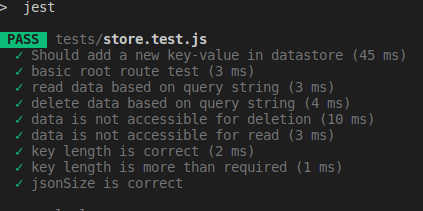
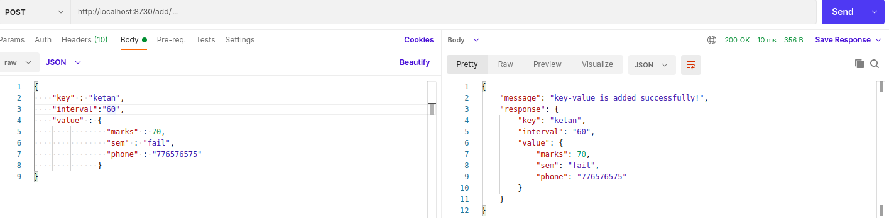
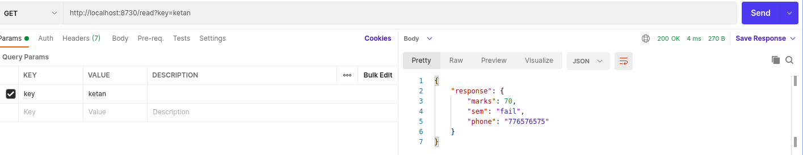
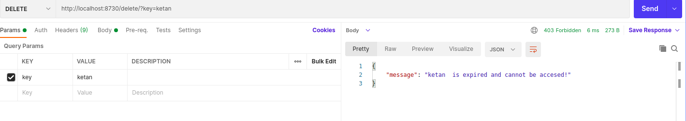

# Data-Store
File based key-value data store that supports CRUD operation
- [Project Description](#project-description)
 - [Goals](#goals)
 - [Tools and Libraries](#tools/libraries)


### Project Description
The goal of this project is to build a fie-based key-value data store that supports the bsic CRD operations.This data is meant to be used as local storage for one single process on one laptop.The data store is exposed as a library to clients that can instantiate a class and work with data store [.](url-link)


### Goals
  - [x] Instantiate a class based object of data store at a reasonable location in file system
  - [x] The key will be string and the value will always be a JSON object
  - [x] Values can be retrieved using key
  - [x] entries is deleted by passing key 
  - [x] A time to live cache is implemented 
  
  
### Approach
CHALLENGES :
1. [Thread Safe](#ThreadSafe)
2. [large file](#lf)
3. [time-to-live](#ttl)

### Solution
1. In nodejs , there is no concept of threads (EVENT-LOOPS) ,though race around conditions may occur and that could lead to ambiguous results.To tackl that,
   we can use mutex locks at critical parts of execution.In our use case using synchronous write operation solves the problem and using locks looks like overkill             
   
2. Reading large files into RAM and handling large data could be challenging.In nodejs ,we are only provided 2 GB of buffer space meaning if the contraint would   have been large we had to look into streams and backpessures.Thankfully , file size was only 1GB which agin works for the use case.

3. Initially,I thought of using min-heaps for storing the token/timestamps and based on root of heaps we could decide if it is expired but letting the user decide the expiry of every element created makes it messy. Finally,I decide to go with hashmaps which elegantly solves the issue.
  
### Implementation

Used reast api to talk to backend written in Nodejs ,after every request ,the information is validated and based on that appproprite response is made and every edge-case is taken care off. Server was built using Express.js and API testing was done using Postman. Singleton design pattern have been used for data models

PS : About TTL , it was not clear whether data which was stored previousy in file can be accesssed or not .Making them accessible made sense to me ,so all the data except that is created at present will not expire for long time(which can be specified ) and will be accessible until and unless server is running.

### Tools/Libraries
1. [Node.js](#nodejs)
2. [Javascript](#Javascript)
3. [Express](#locks)
4. [GIT](#git)
5. [Jest](#jest)
6. [body-parser](#body-parser)


## Quick Start

```bash
$ git clone https://github.com/llucifer97/Data-Store.git
$ cd Data-Store
```

Install dependencies:

```bash
$ npm install 
```


  Start the program:

```bash
$ cd src/
$ npm start <file_path> dev 
   OR  
$ npm start <file_path> test
```


Run test:

```bash
$ npm test
```











### About Me

- **Name**: Ayush Raj
- **Email**: ayushraj.bit17@gmail.com

